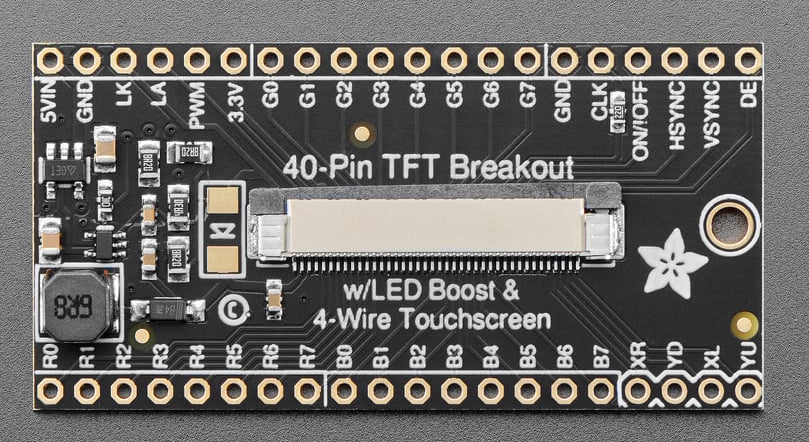

# Hardware

### Materials
- Display: 5.0" 40-pin TFT Display - 800x480 with Touchscreen, from Adafruit: 1596. 
- TFT 40 Pin Adapter: 40-pin TFT Friend - FPC Breakout with LED Backlight Driver, from Adafruit 1932. It has a built in boost converter because the display backlight requires 20V.
- FPGA Board: DE10-Lite. Developement board with plenty of exposed GPIO pins, as well as LEDs and switches for testing.
- Custom PCB to adapt from the TFT 40 Pin Adapter to the DE10-Lite. The DE10-Lite has a 40 pin GPIO header which will be used to connect to the screen. The PCB also has a small ADC and connector attached because extra pins are needed for the ADC.

- 2 Channel ADC: MCP3202-CI/P. Used to read the analog touchscreen values.

### TFT Pinout Information

- RGB: There is an 8 bit channel for the red, green, and blue colors totalling 24 pins. Alpha is ignored when sending pixel data to the screen. Read more about the colors in Color.md.
- Touchscreen: XL/R, YU/D are the controls for the touchscreen, read more in Touchscreen.md.
- LK, LA, PWM: Standing for LED Cathode, LED Anode, and Pulse Width Modulation, these 3 pins control the LED backlight. Because the TFT adapter has a built-in boost converter, LK and LA do not need to be connected as they connect straight to the backlight. The PWM controls how bright the backlight is and will be controlled by the FPGA. The range is 5 to 100 kHz.
- ClK, HSYNC, VSYNC, DE: The clock, HSYNC, VSYNC, and data enable pins are what control the timing for the pixels being loaded onto the device. There are 2 possible modes: HV mode and DE mode. The HV mode is where the HSYNC and VSYNC modes are used to control the timing. The DE mode is where the HYSNC and VSYNC isn't used and the DE is syncronized with the clock. The internal controller automatically handles the syncing. However because this is boring, HV mode is used.
- On/Off: This turns the display and backlight on and off
