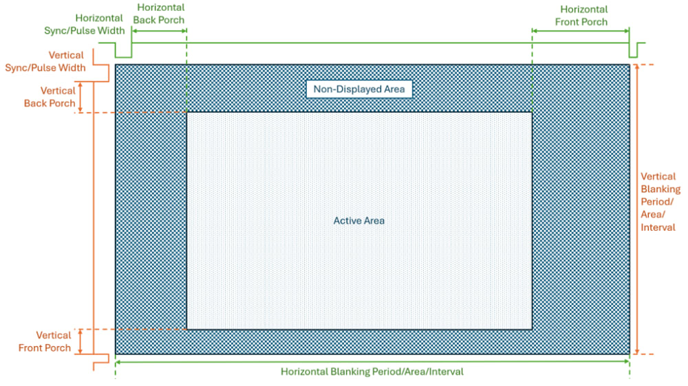

# Timing

### Basics and Porches

There is 3 pins (technically 4) that control the timing of the TFT display: Clock, HSYNC, and VSYNC. For the TFT display, the pixels are sent one at a time. This data is captured or latched in at the rising edge of the clock pin. After all 800 pixels in one line is loaded into the TFT display, the HSYNC signal is sent to load that row onto the display. This process is repeated for all 480 rows. After all 480 rows have been loaded in, the VSYNC signal is sent which resets the row counter back to the first. The HSYNC and VSYNC signals are active-low, meaning they are normally high and activate on a falling edge.

There is delays between the data being sent for one row and the next known as porches. This gives time for the sent data to actually be loaded into the pixels and for everything to reset, for old CRT displays this gave time for the laser gun to move back to the start. The data is sent, then there is a front porch, the HSYNC signal is sent, then there is the back porch before more data is sent. There is also VSYNC porches. Horizontal porches are timed in clock cycles and vertical porches is timed in lines.

Source: [RS DesignSpark](https://www.rs-online.com/designspark/lcd-tft-displays-timing-parameters-explained)

### Horizontal Timing information

- __Clock Cycle 0: HSYNC driven Low__
- _Clock Cycle 2: STV goes high (Only happens after row 1 data is loaded)_
- _Clock Cycle 4: OEV goes high_
- __Clock Cycle 10: HSYNC driven High, start of HSYNC Back Porch__
- Clock Cycle 20: CKV goes high_
- _Clock Cycle 64: LD goes high_
- _Clock Cycle 74: LD goes Low_
- _Clock Cycle 78: OEV goes low_
- _Clock Cycle 86: CKV goes low_
- __Clock Cycle 200: Clock is turned on, Data starts to load, end of HSYNC Back Porch__
- __Clock Cycle 1000: Clock is turned off, Last data for the row was on cycle 999, start of HSYNC Front Porch__
- __Clock_Cycle 1200: HSYNC driven Low, cycle moves to next row, end of HSYNC Front Porch__

### Verical Timing Information
_Note: The HSYNC signal pulses every 1200 clock cycles during the VSYNC, porches, and data loading phases._

- __Row Cycle 1 (Clock Cycle 0): VSYNC driven Low, HSYNC driven Low__
- _Clock Cycle 10: HSYNCP driven High_
- _Row Cycle 2 (Clock Cycle 1200): HSYNC driven Low_
- _Clock Cycle (1210): HSYNC driven Low, the HSYNC signals will only be shown when VSYNC is changed from now on_
- __Row Cycle 6 (Clock Cycle 6000): VSYNC driven High, HSYNC driven Low, Start of VSYNC Back Porch__
- __Row Cycle 20: HSYNC driven low, Data will now be sent for row 1, End of VSYNC Back Porch__
- __Row Cycle 500: HSYNC driven low, Data is no longer being sent, row 480 was sent on cycle 499, Start of VSYNC Front Porch__
- __Row Cycle 525: VSYNC driven low, moving to the next frame, end of VSYNC Front Porch__

### Internal Signals

- STV: Start of Vertical, this internal signals is what transitions from the VSYNC back porch with no data going to the pixels after the HSYNC pulses, to the inputted data being written to the Column drivers and the pixels.
- OEV: Output Enable Voltage, this internal signal is what allows the data to actually be written to the pixels by enabling the row drivers. It is on during the loading period but off other times.
- CKV: Clock Vertical, this internal signal is what transitions the row drivers to be on the right row. It turns on before the data is loaded.
- LD: Load Data, this internal signal actually controls the data being loaded, during those 10 clock cycles the DACs in the column drivers load the colors into the pixels for the row controlled by the row driver.

